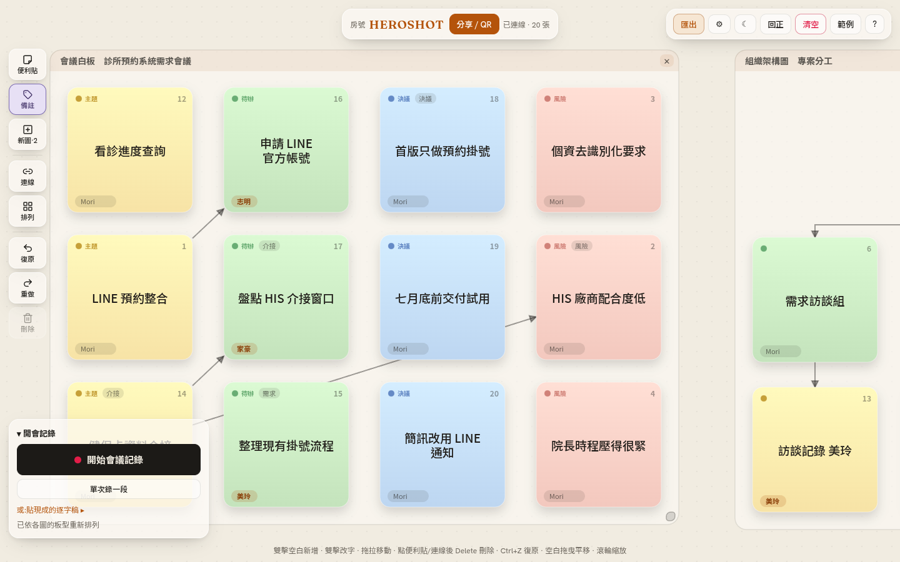

# Mori Canvas

> Language: [繁體中文](README.md) ・ **English**

**Talk, or paste a transcript — AI turns it into sticky notes and a relationship diagram on a live, multiplayer meeting whiteboard.** Self-hosted, zero licensing cost (all MIT).

**[Try it](https://mori-canvas.onrender.com/) ・ [See a finished board](https://mori-canvas.onrender.com/?room=DEMO) ・ [Manual](https://yazelin.github.io/mori-canvas/) ・ [GitHub](https://github.com/yazelin/mori-canvas)**

> Live and under active development. The free demo may be buggy and sleeps when idle — you're very welcome to fork / self-host it.

```
meeting audio ──STT(cloud Groq / local whisper)──▶ transcript ──cleanup──▶ AI(Groq gpt-oss-120b / local qwen3)──▶ stickies + links ──yjs──▶ live multiplayer board
                                                                                people can also drag / edit / connect / delete on the same board
```



The whole board above **grew itself** from one meeting transcript fed to the AI: stickies are coloured by kind (topic = yellow, decision = blue, to-do = green, risk = red), arrows show relationships.

Not sure where to start? Open the app and hit **Examples** (top right) to load one of five persona boards (Meeting notes / Engineer / Product manager / Marketer / Consultant), each with sample phrasings that show what to say to grow that board.

---

## How it works (read this and you'll know what to install)

**Client–server architecture. All the heavy lifting (STT, AI, layout, board state) runs on the host machine**; everyone else just connects from a browser — zero install.


### From "you say one sentence" to "a board action"

1. **Browser**: mic records, auto-cuts a segment on each pause → POSTs the audio to the host (`/api/voice`).
2. **Host · STT**: turns audio into text (mori-ear / cloud Groq Whisper / local whisper-server, switchable in Settings).
3. **Host · cleanup (stage 1)**: raw STT is full of fillers ("um", "you know"), bad sentence breaks and typos. A rule layer runs first (collapse repeats, strip leading interjections), then an LLM does a minimal cleanup (`prompts/transcript-cleanup.md`: fix typos, restore punctuation / re-segment, remove fillers, no semantic drift). If the LLM fails it falls back to the rule-layer output, so **cleanup never blocks card creation**. Short inputs (<10 chars, usually commands) skip the LLM pass; the API can pass `"cleanup": false` to skip it.
4. **Host · AI draws cards (stage 2)**: the cleaned text + the whole current board (each card's kind / owner / tags, with indices) go to the LLM, which first decides whether this is a **command** or **content**, and returns a single JSON object.
5. **Host · validate + apply** (hard-coded rules, not the AI): checks the JSON is valid (indices in range, actions valid). Commands run directly (arrange / filter / assign / recolor / tag / rewrite / move / connect); content becomes stickies, or edits/merges/deletes existing cards.
6. **Sync back to everyone**: board changes broadcast over yjs (websocket) to every browser in real time; view-only commands (like filter) are returned to just the speaker's tab.

Intent is understood by the **LLM, not keyword matching**: "give it to Mike" = assign, "rewrite as online check-in" = edit text, "make it a risk" = recolor. Pasting an existing transcript takes the same path, just skipping step 2.

- **AI**: Groq `gpt-oss-120b` (local Ollama `qwen3` fallback), key/model from the shared `~/.mori/config.json`.
- **STT**: three options (Settings) — mori-ear / cloud Groq Whisper / local whisper-server. Traditional-Chinese output is hard-converted in code (OpenCC), not left to the model.
- **Realtime sync**: a self-written yrs (Rust) sync server that interops with the yjs JS client — no cloud service.
- **Runs standalone** (no dependency on the Mori ecosystem), but can optionally install into AgentOS as a body-part (`meeting.visualize` http-service). Its only ties to Mori are the `mori-ear` CLI + shared config; otherwise it's a standalone FOSS app.

---

## What to install

### A. The host (the machine running everything)

| Requirement | Purpose | Needed? |
|---|---|---|
| **Rust** (`cargo`) | runs the server — one binary embedding the frontend + API + realtime sync | required when building from source (not needed with Docker / prebuilt) |
| **Node.js 18+** + npm | **only builds the frontend** (`npm install` + `npm run build`); not needed at runtime | same as above |
| **Groq API key** (`~/.mori/config.json` `providers.groq.api_key`, or `.env` / env `GROQ_API_KEY`) | the "transcript → stickies" AI | required for the agent (or use BYO / local Ollama) |
| **mori-ear** CLI + whisper, or local whisper-server, or cloud Groq Whisper | "audio → text" | only for voice; typing / pasting transcripts needs none of it |
| Ollama + `qwen3` (`ollama serve`) | local fallback when Groq is unreachable | optional |

> **Just want to type, no voice?** Node + `npm install` + a Groq key is enough (type / paste transcript → stickies).

### B. Everyone else (joining to collaborate)

**Nothing to install.** Same network (or a public URL) + a modern browser; open the host's URL and allow the mic if you want to record. Their audio is processed by **the host's** STT + AI — it costs them nothing.

---

## Running it

The backend is Rust (`server-rs/`); one binary bundles frontend + API + sync (the built `client/dist` is embedded with `include_dir`, so it runs from any directory). There's also a Tauri desktop build (`src-tauri/`).

```bash
npm install
npm run build          # = vite build (frontend) → cargo build --release (Rust binary, embeds the frontend)
```

### 1) Local, just for yourself

```bash
npm run dev            # build + run the debug binary; defaults to http://0.0.0.0:1334
```
Open `http://localhost:1334/?room=meet`.

### 2) LAN (multi-device / phones can record too)

Phones need **HTTPS** to use the mic (browser rule). The Rust server serves HTTPS itself (`HTTPS=1` + `certs/`):

```bash
npm run setup          # = bash setup.sh: detect your LAN IP + make a self-signed cert for it (in certs/, gitignored); re-run if the IP changes
npm run build          # first time / after frontend changes
npm run start:lan      # = HTTPS=1 PORT=5174 BIND=0.0.0.0 ./server-rs/target/release/mori-canvas-server
```
Everyone connects to `https://your-lan-ip:5174/?room=meet` (note https). Each device accepts the self-signed cert once (covers page + sync + mic). There's no auth on the LAN port — fine for trusted networks; **close it when you're done** (`kill $(lsof -ti tcp:5174)`).

### STT: three options — switch in ⚙ Settings

| Mode | How STT happens | Best for |
|---|---|---|
| **Mori** | delegates to `mori-ear` (it picks local whisper / Groq itself); only offered when mori-ear is detected | you, with Mori installed |
| **Custom · cloud** | Groq Whisper API with your own Groq key | clients, **zero install** — the default |
| **Custom · local** | hits a local **whisper-server** (`/inference`) | keeping data off the network |

Custom modes **trim silence** (ffmpeg) before sending to STT, so Whisper doesn't hallucinate over silence. Install a local whisper-server with `bash scripts/setup-whisper-linux.sh` (or `scripts\setup-whisper-windows.ps1`); it listens on `127.0.0.1:8089`. In Settings, point at `http://127.0.0.1:8089/inference` (leave blank to auto-detect `~/.mori/whisper-server.json`).

---

## Deploying / sharing

### 1) Demo (no install, just a link)

The community demo runs on Render: [mori-canvas.onrender.com](https://mori-canvas.onrender.com/). Friends scan the QR and they're in. For a ten-second look at a finished board, open the [demo board](https://mori-canvas.onrender.com/?room=DEMO) (resets hourly). The AI uses the host's Groq key (with per-IP rate limiting); to use your own quota, fill any OpenAI-compatible base/key/model under ⚙ Settings → BYO, or just paste a transcript.

**Deploy your own to Render (GitHub-driven):** render.com → sign in with GitHub → New + → Blueprint → pick the repo (reads `render.yaml`) → set `GROQ_API_KEY` and `ADMIN_TOKEN` (see Security) under Environment → Deploy. Every `git push` redeploys. The free tier sleeps after 15 min idle (~30–60s cold start on the next visit).

### 2) Run the server yourself (for a team / self-host)

**Fastest — Docker one-liner** (the image is published to ghcr by CI on a `v*` tag):
```bash
docker run -p 1334:1334 -v "$PWD/data:/app/.data" -e GROQ_API_KEY=gsk_xxx ghcr.io/yazelin/mori-canvas
```
Boards persist to `./data` (delete the container without a volume and they're gone).

**Linux one-click install** (prebuilt binary from GitHub Releases, no Rust / no Node):
```bash
curl -fsSL https://raw.githubusercontent.com/yazelin/mori-canvas/main/install.sh | bash
mori-canvas-server                    # defaults to http://0.0.0.0:1334
```
Installs to `~/.local/share/mori-canvas/`, symlinks the command into `~/.local/bin/`; re-run to upgrade. macOS / Windows: grab the matching server bundle from [Releases](https://github.com/yazelin/mori-canvas/releases).

> The Docker image, prebuilt binaries and desktop installers are produced by CI **only when a `v*` tag is pushed**; until a tag is published, use "build from source" below.

**Build from source:**
```bash
git clone https://github.com/yazelin/mori-canvas && cd mori-canvas
npm install && npm run build
./server-rs/target/release/mori-canvas-server   # defaults to http://0.0.0.0:1334
```
For a long-running deploy with real TLS, use [`deploy/mori-canvas.service`](deploy/mori-canvas.service) (systemd) + [`deploy/nginx.conf.example`](deploy/nginx.conf.example) (reverse proxy); follow the header comments, put env in `/etc/mori-canvas.env`.

### 3) Desktop app (double-click to open)

GitHub Releases has `.msi`/`.exe` (Windows) and `.AppImage`/`.deb` (Linux) — double-click to install a native window. Build locally with `npm run tauri` (embeds the server on loopback:8731). The desktop app is single-user; **for multiplayer meetings use "run the server yourself"** (binds 0.0.0.0).

### 4) Install into AgentOS

`meeting.visualize` is an AgentOS **http-service** (`/api/visualize`: a full transcript → board + export). With [AgentOS](https://github.com/yazelin/agentos) installed: `agentos install /path/to/mori-canvas/agentos-manifest.json --principal me`. Starting the desktop build (or `MORI_CANVAS_REGISTER=1`) writes `~/.mori/mori-canvas-server.json` so AgentOS can dispatch to it. Standalone behaviour is unaffected.

---

## Security / privacy (read before any public deploy)

- **`ADMIN_TOKEN` (env)**: set it for public deploys. Once set, `POST /api/settings` and "end room" require a matching `X-Admin-Token` header or get 401 — visitors can't touch host-level fields (whisperUrl, STT mode, local-only, host Groq key).
- **With no token set**: host-level fields only accept changes from a **direct local** request (loopback **and no `X-Forwarded-For`**); personal prefs like spacing stay open. ⚠️ Render / same-host reverse proxies connect to the app over loopback, so "carries XFF = came through a proxy = not a local admin" — these deploys must set `ADMIN_TOKEN` (without it host fields are rejected for all external visitors, so nothing can be hijacked, but you can't change them either without the token).
- **`LLM_LOCAL_ONLY=1`**: locks local-only mode at boot — AI uses local Ollama only, cloud STT and visitor BYO endpoints are blocked, and Settings/API can't turn it off (data stays on the network).
- **Read-only links + owner lock**: the share panel can "copy a read-only link" (`?view=1`, viewers can only look); the first person in a room is its owner and can "lock the board" so everyone else becomes read-only. Both are **enforced by the server dropping unauthorized writes at the ws layer**, not just UI hiding.
- **BYO key stays in your browser**: a Groq key pasted in Settings rides along per request as a BYO header — it never becomes server-global and visitors can't overwrite each other.
- **Demo governance**: `DEMO_RATE_PER_MIN` (per-IP limit, 429 + Retry-After when exceeded), `ROOM_TTL_HOURS` (auto-clean idle rooms; demo uses 72h), `MAX_ROOMS` (room cap), `PUBLIC_ROOM_LIST=0` (room list returns a count only, never room codes). See `.env.example`.

---

## Using it

- **Run a meeting (the main use)**: bottom-left "**● Start recording**" → continuous capture; talk, pause, and each segment is auto-cut, transcribed, and laid out by the AI — fully hands-free. While recording you get **live volume bars**; too long without sound warns you to check the mic; if the OS interrupts recording (app switch / screen off) a "**tap to resume**" banner appears. You can also "record one take" or paste a transcript and "send to agent". "**Undo last AI**" removes the cards/links the last AI turn added.
- **First visit**: a guide card + a 6-step interactive tour (spotlighting real buttons); re-open it, re-run it, or open the **example gallery** anytime from the "?" top-right.
- **On the board**: double-click empty space to add, double-click a sticky to edit (long text **auto-grows height and shrinks font**), drag to move, connect mode to link two stickies, Delete to remove, **Ctrl+F to search cards** (pans the camera + highlights), Ctrl+Z to undo (including frame delete/move/rename), drag empty space to pan, wheel / pinch to zoom, reset view, clear.
- **Share / QR**: toolbar "Share / QR" → set your name, show the room code + QR (phones scan straight in) + link + active rooms; plus copy read-only link, lock board, end this room.
- **Export**: **board summary** (AI writes a one-page note per board type) / **HTML** (summary + board image + transcript, double-click to read) / **MD** / **whole-board PNG** (themed background, one-click copy to clipboard); **board file (.json)** restores fully and hands off to someone else. Export language follows the UI language.
- **Board types × auto-layout**: switch type via the toolbar badge — **10 types** (Meeting / Org chart / Flowchart / Architecture / Mind map / Kanban / SWOT / Timeline / Fishbone / Gantt). The type (stored in yjs) drives how the AI reads cards and links, how it colours and arranges them. **Layout guarantees cards and frames never overlap** (tidy-tree with centered parents, mind-map rings that grow with card count, SWOT grid, classic fishbone; a collision pass after every layout, and frames re-pack on "Arrange").
- **Rooms**: rooms persist (`.data/<code>.bin`) — they survive with nobody connected and reload on restart. `?room=DEMO` is the always-on demo board (resets hourly to its seed); each gallery template has a deep link `?room=<new-code>&board=<id>` that grows the whole board in a fresh room when opened.

API (one port, dev default :1334; `/sync` is ws, the rest HTTP):
```bash
curl -X POST localhost:1334/api/agent/meet -H 'Content-Type: application/json' \
  -d '{"transcript":"In today's meeting we discussed…"}'   # transcript → board (sentence by sentence)
curl localhost:1334/api/export/meet                          # export markdown (?lang=en for English)
curl -X POST localhost:1334/api/visualize -H 'Content-Type: application/json' \
  -d '{"transcript":"the whole transcript…"}'               # one shot: transcript → board → markdown/summary + an editable url
# Bring your own AI: add -H "X-LLM-Base: …" -H "X-LLM-Key: …" -H "X-LLM-Model: …"
# Pick AI output language: add -H "X-Lang: en"
```

---

## Language

The UI ships in **Traditional Chinese (zh-TW) and English** — auto-detected from the browser (`navigator.language` starting with `zh` → zh-TW, otherwise English), switchable in ⚙ Settings and remembered (`localStorage` `wb-lang`). **AI output follows the UI language**: the client sends an `X-Lang` header on every AI request (`/api/summary` and `/api/export` use `?lang=`); for `en` the server appends an English-output directive to the prompt, skips the OpenCC conversion, and translates exported board-type names / section headers / relation headers too. Requests without the header behave exactly as before (zh-TW default). Example gallery boards are "content, not UI" and stay in Chinese; proper nouns (Mori Canvas, Groq, Ollama…) aren't translated either way.

---

## Community templates

The example gallery (top-right "Examples" in the app) shows the five built-in persona examples plus community-submitted templates (`client/public/templates/`). To submit your own board, see [templates/README.md](client/public/templates/README.md); for bug reports and PR conventions, see [CONTRIBUTING.md](CONTRIBUTING.md).

---

## Feature overview

- **Two-stage AI (cleanup → draw)**: the transcript is de-fillered / re-punctuated / re-segmented (`prompts/transcript-cleanup.md`, live-reloaded) before the card agent, so fillers and bad breaks never reach the cards.
- **AI layout + accumulate-and-merge**: transcript → Groq `gpt-oss-120b` (qwen3 fallback) → stickies (coloured by kind) + relationship links; existing cards are fed back so the agent only adds what's new, and it can rewrite / merge / delete existing cards (op-based).
- **Continuous recording + resilience**: VAD silence auto-cut, hands-free; live volume bars, no-voice warning, "recognizing" state, automatic retry + manual resend on failed segments, 429 backoff-and-resume, mobile screen wake lock + interruption recovery, mono 48 kbps uploads to save data.
- **Voice commands (intent detection)**: the agent tells "content" from "command" — "arrange this / only show Alice's / assign this to Mike / make it a decision / connect 3 to 5 / open three zones" run directly.
- **Voice meeting facilitation**: named zones + move + connect; the AI figures out which existing card you mean (by content / order / number) and edits it instead of duplicating.
- **Owners + tags + filter + search**: the agent extracts owners (chips) and tags (#tag), click a chip to filter; Ctrl+F to search and pan-highlight.
- **Speaker attribution + a visible Mori**: with a name set, cards are tagged with who raised them and cursors show real names; while the agent writes, yjs awareness broadcasts Mori's cursor — cards stream in, then it leaves.
- **Board types × auto-layout (overlap-free)**: 10 types, 6 layouts, frame-aware; tidy-tree / adaptive radial / SWOT grid / classic fishbone + collision pass + frame re-packing.
- **Read-only links + owner lock**: `?view=1` read-only links and an owner board-lock, enforced at the server ws layer.
- **Example gallery + interactive tour**: five persona examples with sample phrasings, a 6-step spotlight tour, `?board=` deep links, a community template channel.
- **Export**: board summary / HTML / MD / whole-board PNG (clipboard) / restorable .json; language follows the UI.
- **Bring Your Own AI**: visitors fill their own OpenAI-compatible base/key/model and spend their own quota.
- **Bilingual UI (zh-TW / English)**: react-i18next, auto-detect + Settings toggle + AI output language follows.
- **Light / dark theme**: ☾/☀ toggle (warm paper / forest night), dark mode has its own card palette.
- **Persistence + room governance**: `.data/<room>.bin` reloads on restart; TTL / MAX_ROOMS / room-code privacy / always-on DEMO room.
- **Multi-device / mobile / PWA**: built-in HTTPS or deploy to Render; phones can view/edit/record, responsive + pinch-zoom + installable as a PWA.
- **Hardening / deploy**: `ADMIN_TOKEN`, `LLM_LOCAL_ONLY`, per-IP rate-limit, Dockerfile + ghcr + render.yaml + install.sh + `deploy/` systemd/nginx examples.


---

## Architecture / files

Backend is **Rust** (`server-rs/`, crate `mori-canvas-server`); the frontend in `client/` is embedded into the binary.

| Part | File | Notes |
|---|---|---|
| sync server | `server-rs/src/sync.rs` | `yrs` + `yrs-warp` multi-room sync (interops with the yjs JS client) + persistence `.data/<room>.bin`; ws-layer write filtering for read-only / lock |
| agent / LLM | `server-rs/src/agent.rs`, `llm.rs`, `apply.rs` | transcript → intent → board plan/command; Groq (`gpt-oss-120b`) → Ollama (`qwen3`); BYO; X-Lang output language; streaming Mori cursor |
| cleanup (stage 1) | `server-rs/src/cleanup.rs`, `prompts/transcript-cleanup.md` | rule layer (repeats / leading interjections) + minimal LLM cleanup; falls back, never blocks card creation |
| layout / board types | `server-rs/src/layout.rs`, `board_types.rs` | 6 layouts + 10 board types, frame-aware; collision pass + frame re-packing, cards/frames guaranteed non-overlapping |
| STT | `server-rs/src/stt.rs` | Mori (delegates to `mori-ear`) / custom (Groq Whisper / local whisper-server + ffmpeg silence-trim) |
| HTTP / service | `server-rs/src/lib.rs` (`serve`) | warp: `/api/*` + `/sync` ws + embedded frontend; rate limit / ADMIN_TOKEN / room governance / DEMO seed; `HTTPS=1`+`certs/` self-TLS; `BIND`/`PORT` configurable |
| client | `client/src/App.tsx`, `i18n.ts`, `locales/*.json`, `fitCardSize.ts` | yjs + WebsocketProvider sync → react-konva render; all interactions + recording/agent panel + example gallery + tour + search + i18n |
| desktop | `src-tauri/` | Tauri 2: embedded server + webview; self-registers as a mori-desktop body part on start |

Docs site (`docs/`, GitHub Pages): five pages — landing / manual / examples / self-host / FAQ.

---

## Gotchas (for whoever's next)

1. **`@y/websocket-server` (yjs v3's official server) can't take writes from a classic yjs client** — it depends on the `@y/y` fork, so client→server writes throw `store.getClock is not a function`. Fix: a self-written classic-yjs server in `yrs` + `yrs-warp` (Rust, `sync.rs`) that interops with the yjs JS client.
2. **Non-ASCII room names need `decodeURIComponent`**: the WS path wasn't decoded while `/api/:room` was auto-decoded by the HTTP router → the same name became two rooms (once caused "the agent says 6 cards but the screen is empty").
3. **Mobile recording needs HTTPS**: `http://<lan-ip>` is an insecure origin and browsers block `getUserMedia` — hence the LAN self-signed HTTPS.
4. **agent JSON**: gpt-oss/qwen3 wrap output in `<think>` / fences — strip them before taking the outer `{...}`; set `think:false` for qwen3; use `{from,to}` for connectors, not `[[a,b]]`.
5. **A reverse proxy makes visitors look like local admins**: Render / same-host nginx connect over loopback, so checking only "is the socket loopback" treats the whole world as admin. "Truly local" = loopback **and no `X-Forwarded-For`** (XFF means it came through a proxy). Any "loopback = trusted" check behind a PaaS / proxy must also require no XFF.
6. **Deeper warp filter chains need `#![recursion_limit = "256"]`** (in both lib and bin), or the giant nested types blow the recursion limit.
7. **Docker build missing a COPY of the seed**: the DEMO room seed is `include_str!`-ed from `client/public/examples`; the server build stage missing that COPY fails every Render build.
8. **i18n output language**: an English directive only at the end of the system prompt gets diluted by the surrounding Chinese instructions (the model translates titles but leaves cards Chinese); strengthen the wording and also prepend an English directive to the user message.
9. **Restart loses data**: writes are debounced — flush on SIGTERM/SIGINT (done).

---

## Status / roadmap

- **Status**: public ([yazelin/mori-canvas](https://github.com/yazelin/mori-canvas), MIT), runs as a Render community demo or self-hosted. Pure-Rust single binary backend; rooms persist to `.data/<code>.bin` (the Render free tier wipes them on sleep/redeploy — download the board file to keep one).
- **Backlog and ideas**: tracked in [GitHub issues](https://github.com/yazelin/mori-canvas/issues) — known gaps and future directions live there.
- **License**: backend Rust (yrs / yrs-warp / warp / reqwest / tokio, MIT/Apache-2.0), frontend (yjs / konva / react-konva / react / vite, all MIT) — can be closed-source, can be sold, with no tldraw-style production license. Three STT options, and **it runs without mori-ear** (a Groq key on cloud mode is enough).
